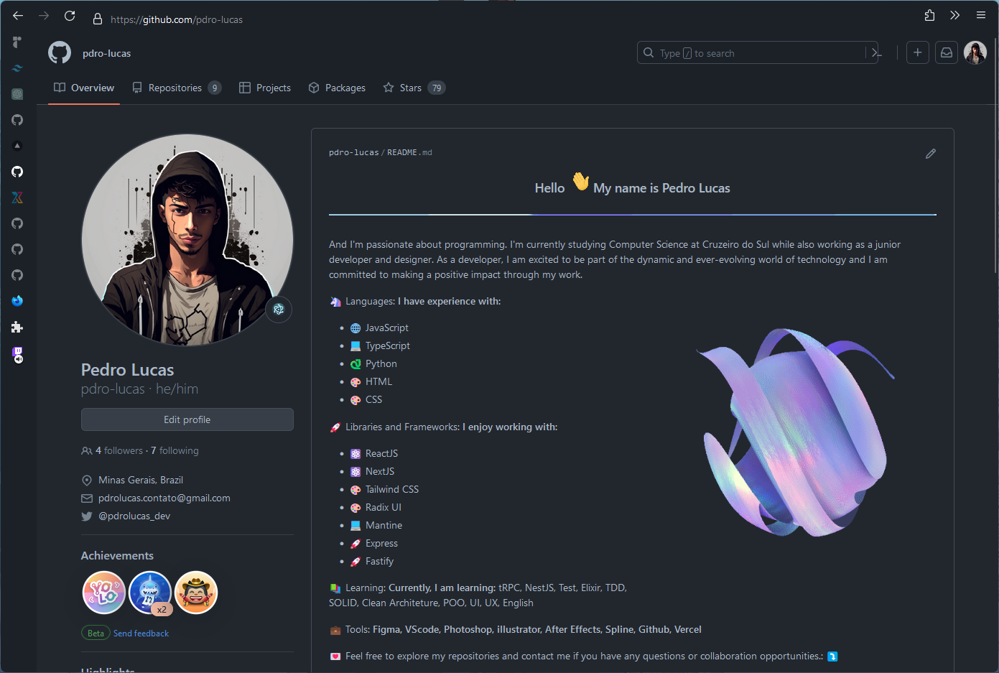

# 🦊 My Firefox Customization

My custom Firefox web browser customization using CSS.

This customization is based on the [Cascade](https://github.com/andreasgrafen/cascade) theme. To make adaptive tab bar colors work, it's necessary to use the Adaptive Tab Bar Color extension for Firefox. [Download here 🎨🔗](https://github.com/easonwong-de/Adaptive-Tab-Bar-Color)

## How to install

1. Type about:config into your URL bar
2. Seach for toolkit.legacyUserProfileCustomizations.stylesheets and set it to true
3. Go to your profile folder
4. Copy the chrome folder into your profile and restart Firefox
